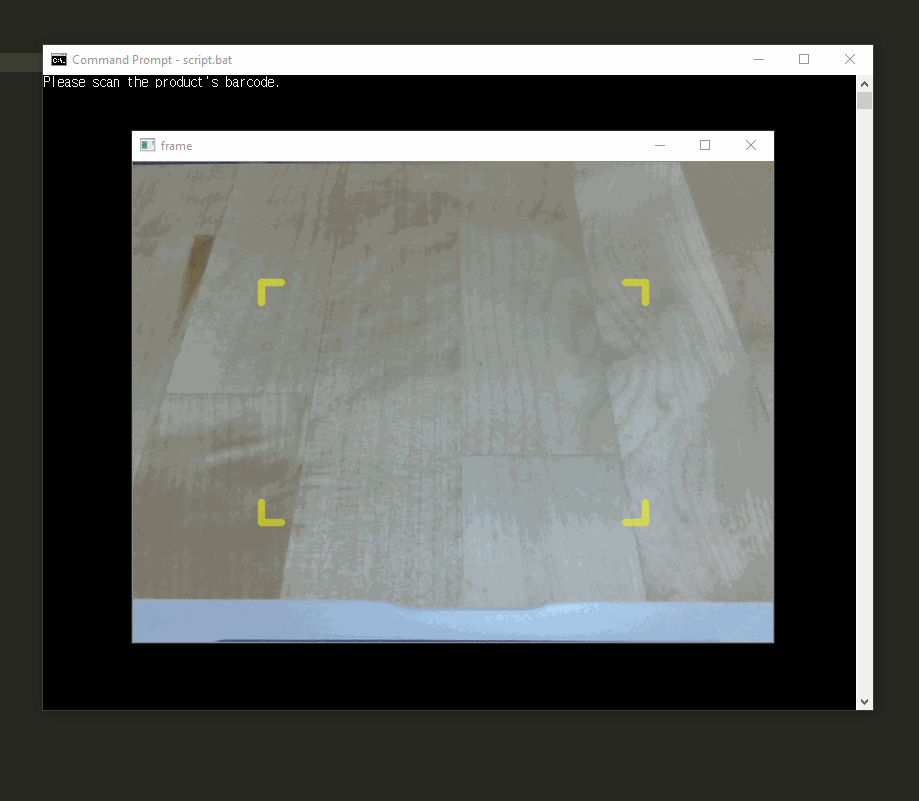

# barcode-decode

## Description

Barcode-decode is a simple barcode-scanning program that can scan a product's barcode, decode its manufacturing number to accurately identify the product, and search for exact and/or similar products online at Coupang (a popular e-commerce website in South Korea). Firstly, the decode program scans a barcode using OpenCV and pyzbar, which instantly deciphers the barcode and returns the numeric code. Using the code, the program then searches through [Koreannet](http://koreannet.or.kr/) to identify the product (if registered on this website). Afterwards, the program refines the product name to optimize search results. The refined keywords are passed on to [Coupang](https://www.coupang.com/) and the program will collect the top ten products along with all the necessary information.

The scrape program utilizes the requests and beautifulsoup module to make HTML requests and parse the HTML components to attain the desired information on websites. Selenium was also necessary to collect data that were not loaded instantly (needed to scroll or wait). All the scraped and gathered information are then neatly organized into an HTML format using html_gen.py, making it easier and more comfortable for the user to read. The batch file (script.bat), once executed, will begin to collect all these information and open the generated HTML file in a web browser. One will need to have a local server in order to view product images.

## Installation

I used the OpenCV package for python (version 4.1.0.25 or above) with Python 3.7.2.

```bash
pip install opencv-python==4.1.0.25
```

To decode barcode and QRcodes, I used pyzbar (version 0.1.8).

```bash
pip install pyzbar
```

And installed requests module (version 2.24.0) to make HTML requests.

```bash
pip install requests
```

I also installed beautiful soup module (version 4.6.0) to parse the attained HTML components.

```bash
pip install beautifulsoup4
```

Lastly, I used selenium module (version 3.141.0) to scrape data not directly loaded on the website.

```bash
pip install selenium
```

## Usage

Clone the barcode-decode repository in your directory.

```bash
git clone https://github.com/byunsy/barcode-decode.git
```

Before executing the program, you need to have a server running. (eg. local 8000). The easiest way to achieve this is to open up a new command terminal to start a simple local server. This method works for Python3.

```bash
python -m http.server
```

Now move to your specific directory and execute the script file.

```bash
script.bat
```

## Demonstrations

The program can accurately detect a barcode, decode it, and search similar products online.



